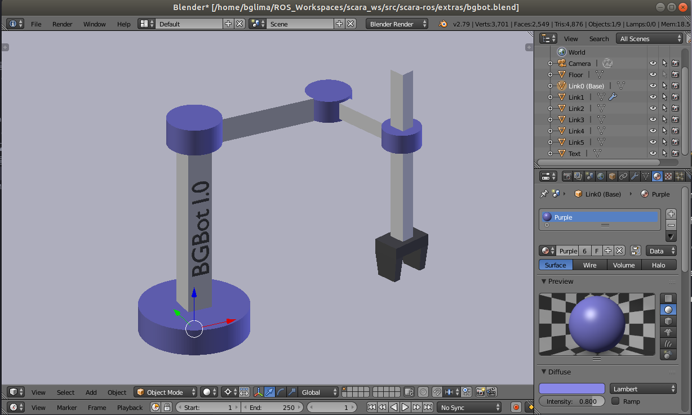
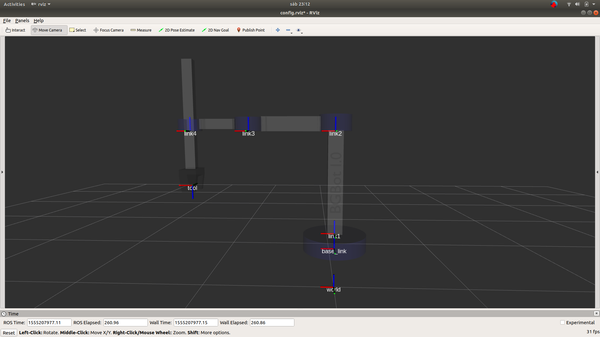
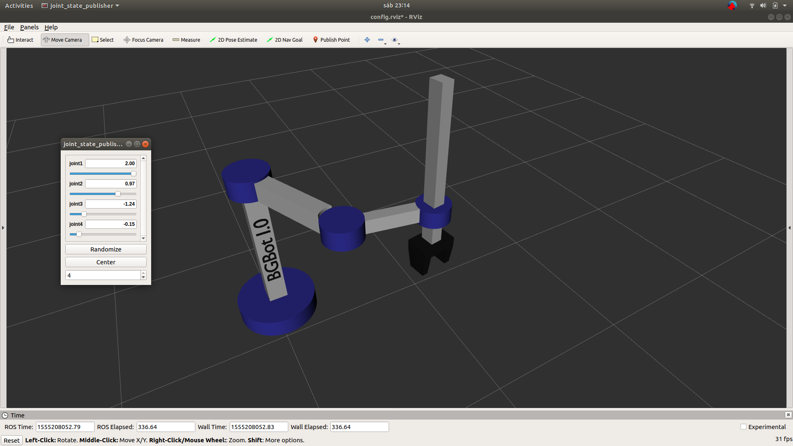
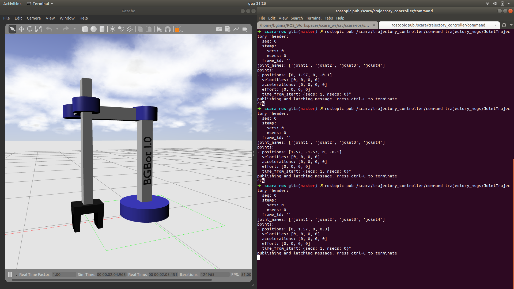

### <TL;DR>

In order to test the package, run:

```
cd ~/catkin_ws/src
git clone ...
cd ~/catkin_ws
catkin_make

# Due to a bug in Ros Melodic, you need to export LC_NUMERIC as follows...
export LC_NUMERIC="en_US.UTF-8"

# And install controller for Gazebo
sudo apt install ros-melodic-joint-trajectory-controller

roslaunch scara-description display.launch gui:=true
```

### How to create a ROS Robot from scratch?

#### Step 1: Visualize the robot in your mind and model it



#### Step 2: Position the frames and generate DH Parameters


| **i** | **θ<sub>i</sub>**   | **d<sub>i</sub>** | **a<sub>i</sub>** | **α<sub>i</sub>** |
| ----- | ------------------- | ----------------- | ----------------- | ----------------- |
| 1     | θ<sub>1</sub>       | d1                | a1                | 0                 |
| 2     | θ<sub>2</sub>       | 0                 | a2                | 0                 |
| 3     | θ<sub>3</sub>       | 0                 | 0                 | 0                 |
| 4     | θ<sub>4</sub>       | -(d3 + l3)        | 0                 | π                 |


where... <br>
d1 = 0.87 m <br>
a1 = 0.625 m <br>
a2 = 0.425 m <br>
l3 = 0.40 m

#### Step 3: Export each part of the robot to .DAE, and start building it in XACRO


```
<?xml version="1.0" ?>

<robot name="robotiq_85_gripper" xmlns:xacro="http://ros.org/wiki/xacro">

  <!-- Properties  -->
  <xacro:property name="height_from_floor" value="0.3"/>
  <xacro:property name="base_height" value="0.115"/>
  <xacro:property name="d1" value="0.87"/>
  <xacro:property name="a1" value="0.625"/>
  <xacro:property name="a2" value="0.425"/>
  <xacro:property name="l3" value="0.40"/>
  <xacro:property name="damping_value" value="1" />
  <xacro:property name="friction_value" value="1" />
  <material name="purple">
    <color rgba="0.252 0.246 .8 1"/>
  </material>
  <material name="white">
    <color rgba="1 1 1 1"/>
  </material>

  [...]

</robot>
```

#### Step 4: Define the inertia of links... Following macros might help!


```
<macro name="cylinder_inertia" params="m r h">
      <inertia  ixx="${m*(3*r*r+h*h)/12}" ixy = "0" ixz = "0"
                  iyy="${m*(3*r*r+h*h)/12}" iyz = "0"
                  izz="${m*r*r/2}" />
      </macro>

<macro name="box_inertia" params="m x y z">
        <inertia  ixx="${m*(y*y+z*z)/12}" ixy = "0" ixz = "0"
                  iyy="${m*(x*x+z*z)/12}" iyz = "0"
                  izz="${m*(x*x+z*z)/12}" />
</macro>

<macro name="sphere_inertia" params="m r">
        <inertia  ixx="${2*m*r*r/5}" ixy = "0" ixz = "0"
                  iyy="${2*m*r*r/5}" iyz = "0"
                  izz="${2*m*r*r/5}" />
</macro>
```


#### Step 4: Enjoy your robot!







### References

* Good places to start

https://ni.www.techfak.uni-bielefeld.de/files/URDF-XACRO.pdf

http://wustl.probablydavid.com/publications/URDFandYou.pdf

* About joints and links

http://wiki.ros.org/urdf/XML/joint

http://wiki.ros.org/urdf/XML/link

* About URDF and Xacro

http://library.isr.ist.utl.pt/docs/roswiki/urdf(2f)Tutorials(2f)Using(20)Xacro(20)to(20)Clean(20)Up(20)a(20)URDF(20)File.html

http://wiki.ros.org/xacro

* About exporting mass and intertia tensor in Blender 3D

https://github.com/dfki-ric/phobos/wiki/Mass-and-Inertia
